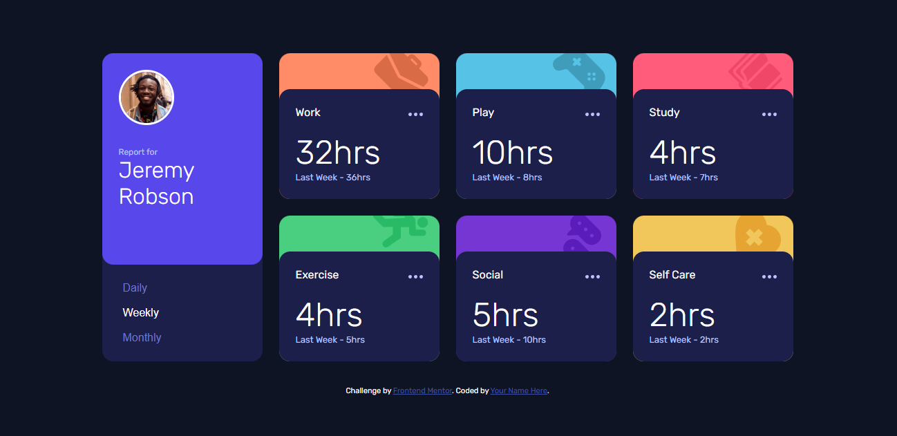

# Frontend Mentor - Time tracking dashboard solution

This is a solution to the [Time tracking dashboard challenge on Frontend Mentor](https://www.frontendmentor.io/challenges/time-tracking-dashboard-UIQ7167Jw). Frontend Mentor challenges help you improve your coding skills by building realistic projects.

## Table of contents

-   [Overview](#overview)
    -   [The challenge](#the-challenge)
    -   [Screenshot](#screenshot)
    -   [Links](#links)
-   [My process](#my-process)
    -   [Built with](#built-with)
    -   [What I learned](#what-i-learned)
    -   [Continued development](#continued-development)
-   [Author](#author)

## Overview

### The challenge

Users should be able to:

-   View the optimal layout for the site depending on their device's screen size
-   See hover states for all interactive elements on the page
-   Switch between viewing Daily, Weekly, and Monthly stats

### Screenshot



### Links

-   Solution URL: [Add solution URL here](https://your-solution-url.com)
-   Live Site URL: [Add live site URL here](https://your-live-site-url.com)

## My process

### Built with

-   Semantic HTML5 markup
-   CSS custom properties
-   Flexbox
-   CSS Grid
-   Mobile-first workflow
-   JavaScript

### What I learned

I find this to be a really interesting project where I get to used javascript but it needs to be optimized. But I actually learn how to use html templates which made it really easy to work with rendering and updating the content.

```html
<header>
    <div class="avatar--wrapper">
        
        <div>
            <p>Report for</p>
            <h1>Jeremy Robson</h1>
        </div>
    </div>
    <div class="dates--wrapper">
        <button type="button" class="time--button" value="daily">Daily</button>
        <button type="button" class="time--button" value="weekly">
            Weekly
        </button>
        <button type="button" class="time--button" value="monthly">
            Monthly
        </button>
    </div>
</header>
```

```css
.card--container {
    width: 100%;
    background-repeat: no-repeat;
    background-position: 90% -0.5rem;
    border-radius: 1rem;
}

.work--background {
    background-color: var(--light-orange);
    background-image: url("./images/icon-work.svg");
}

.play--background {
    background-color: var(--soft-blue);
    background-image: url("./images/icon-play.svg");
}
```

```js
buttons.forEach((btn) => {
    btn.addEventListener("click", (e) => {
        // if they clicked the same btn
        // it won't re-render
        if (btn === activeButton) {
            return;
        }

        if (activeButton) {
            activeButton.classList.remove("active");
        }
        btn.classList.add("active");
        activeButton = btn;
        timeframe = e.target.value;
        updateData();
    });
});
```

### Continued development

I still have the javascript code to update as I can find a more effiecent and modular way to render and update the items

## Author

-   Website - [DYlan Heslop](https://linkedin.com.heslopd23)
-   Frontend Mentor - [@dylan-dot-c](https://www.frontendmentor.io/profile/dylan-dot-c)
